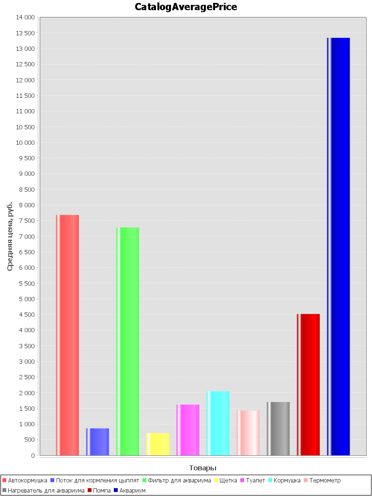
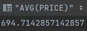
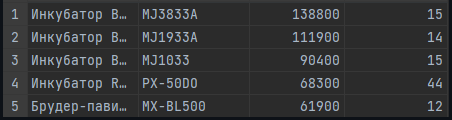

#Итоговый проект по курсу Java (2 вариант)

## Ход работы
1. Сделал структруру для хранения данных из CSV файла
2. Распарсил CSV и создал массив catalogColumns
3. Создал БД и выполнил первое задание, создав гистограмму

### Задание 2.
Средняя стоимость инфракрасной лампы

### Задание 3.
5 самых дорогих товаров со остатком на складе больше 10

